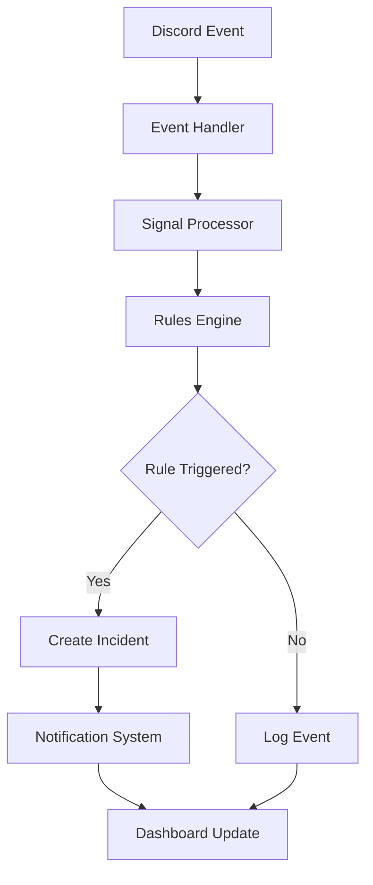
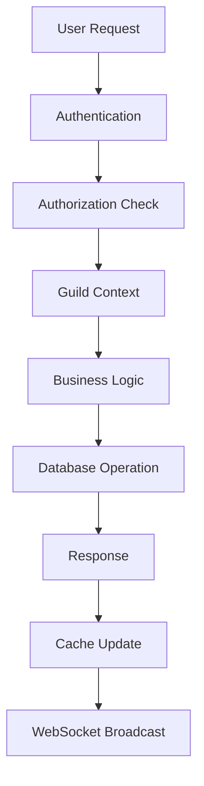
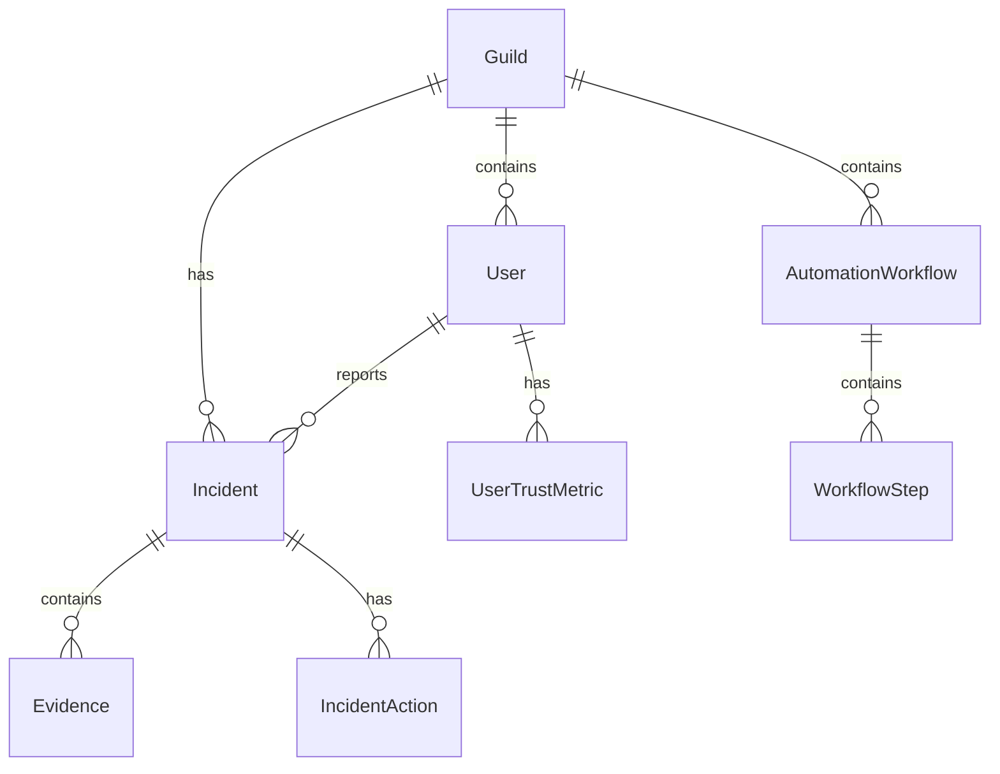

# 🏗️ System Architecture

## Overview

Supremo Discord Bot is built as a modern monorepo with a microservices-inspired architecture, designed for scalability, maintainability, and multi-tenant operation.

## 📁 Project Structure

```
superbot/
├── apps/                    # Applications
│   ├── server/             # NestJS Backend API
│   └── web/                # Next.js Frontend Dashboard
├── packages/               # Shared Libraries
│   ├── shared-types/       # TypeScript type definitions
│   ├── rules-engine/       # Moderation rules engine
│   └── utils/              # Common utilities
├── docs/                   # Documentation
└── .github/                # GitHub workflows and templates
```

## 🎯 Core Components

### 1. Backend Server (`apps/server/`)

**Technology Stack:**
- **Framework**: NestJS with TypeScript
- **Database**: PostgreSQL with Prisma ORM
- **Authentication**: JWT + Discord OAuth2
- **Caching**: Redis-compatible layer
- **Queue System**: Bull/BullMQ for background jobs
- **WebSocket**: Real-time updates

**Key Features:**
- Multi-tenant architecture with guild-scoped operations
- Role-Based Access Control (RBAC)
- Comprehensive API with 200+ endpoints
- Real-time event processing
- Background job processing
- Audit logging and analytics

### 2. Frontend Dashboard (`apps/web/`)

**Technology Stack:**
- **Framework**: Next.js 16 with React 19
- **Styling**: Tailwind CSS with dark/light themes
- **State Management**: React Query for server state
- **Forms**: React Hook Form with Zod validation
- **Charts**: Recharts for data visualization
- **Icons**: Lucide React

**Key Features:**
- Responsive design for desktop and mobile
- Real-time updates via WebSocket
- Comprehensive guild management
- Advanced analytics and reporting
- Drag-and-drop workflow builder
- Multi-language support (i18n)

### 3. Shared Packages

#### `@supremo/shared-types`
- Common TypeScript interfaces and types
- Ensures type safety across frontend and backend
- Includes user, incident, action, and configuration types

#### `@supremo/rules-engine`
- Moderation rules processing engine
- Configurable rule system for content analysis
- Confidence scoring and risk assessment
- Signal processing for real-time events

#### `@supremo/utils`
- Common utility functions
- Date/time helpers
- String manipulation
- Discord-specific utilities
- Validation helpers

## 🔄 Data Flow

### 1. Discord Event Processing



### 2. User Request Flow



## 🏢 Multi-Tenant Architecture

### Guild Isolation

Every operation in Supremo is scoped to a specific Discord guild (server):

1. **Database Level**: All models include `guildId` foreign key
2. **API Level**: Guild context extracted from JWT token
3. **Cache Level**: Keys prefixed with guild ID
4. **Queue Level**: Jobs tagged with guild ID

### Data Isolation

```typescript
// Example: Guild-scoped query
const incidents = await prisma.incident.findMany({
  where: {
    guildId: currentGuild.id,
    status: 'open'
  }
});
```

### Resource Allocation

- **CPU**: Shared processing with fair scheduling
- **Memory**: Per-guild caching with limits
- **Storage**: Isolated database schemas
- **Rate Limiting**: Per-guild API limits

## 🛡️ Security Architecture

### Authentication Flow

1. **Discord OAuth2**: User authenticates with Discord
2. **JWT Token**: Server issues signed JWT with guild permissions
3. **Token Validation**: Every request validates JWT signature
4. **Permission Check**: RBAC system validates user permissions

### Authorization Layers

1. **Route Guards**: Protect API endpoints
2. **Guild Guards**: Ensure user has access to guild
3. **Permission Guards**: Check specific permissions
4. **Resource Guards**: Validate ownership/access to resources

### Data Protection

- **Encryption**: Sensitive data encrypted at rest
- **Sanitization**: All user input sanitized
- **Audit Logging**: Complete action history
- **Rate Limiting**: Prevent abuse and DoS

## 📊 Database Architecture

### Core Models



### Key Relationships

- **Guild → Users**: Many-to-many through guild membership
- **Guild → Incidents**: One-to-many with cascade delete
- **User → Trust Metrics**: One-to-one per guild
- **Incident → Evidence**: One-to-many with file attachments
- **Workflow → Steps**: One-to-many with ordered execution

## 🚀 Scalability Considerations

### Horizontal Scaling

1. **Stateless Services**: All services are stateless
2. **Load Balancing**: Multiple server instances behind load balancer
3. **Database Sharding**: Guild-based sharding strategy
4. **Cache Distribution**: Redis cluster for caching

### Performance Optimization

1. **Database Indexing**: Strategic indexes on frequently queried fields
2. **Query Optimization**: Efficient queries with proper joins
3. **Caching Strategy**: Multi-level caching (Redis, in-memory)
4. **Background Processing**: Async jobs for heavy operations

### Monitoring & Observability

1. **Metrics**: Application and system metrics
2. **Logging**: Structured logging with correlation IDs
3. **Tracing**: Distributed tracing for request flows
4. **Alerting**: Real-time alerts for critical issues

## 🔧 Development Architecture

### Code Organization

```typescript
// Feature-based organization
src/
├── modules/           # Feature modules
│   ├── auth/         # Authentication
│   ├── guilds/       # Guild management
│   ├── incidents/    # Incident handling
│   └── automation/   # Workflow automation
├── common/           # Shared code
│   ├── guards/       # Security guards
│   ├── decorators/   # Custom decorators
│   └── filters/      # Exception filters
└── config/           # Configuration
```

### Testing Strategy

1. **Unit Tests**: Individual function/method testing
2. **Integration Tests**: Module interaction testing
3. **E2E Tests**: Full application flow testing
4. **Load Tests**: Performance and scalability testing

### CI/CD Pipeline

1. **Code Quality**: Linting, formatting, type checking
2. **Testing**: Automated test execution
3. **Security**: Vulnerability scanning
4. **Deployment**: Automated deployment to staging/production

## 🔮 Future Architecture Considerations

### Microservices Evolution

As the system grows, consider splitting into microservices:

1. **Auth Service**: Authentication and authorization
2. **Guild Service**: Guild management and configuration
3. **Moderation Service**: Rules engine and incident handling
4. **Automation Service**: Workflow processing
5. **Analytics Service**: Data processing and reporting

### Event-Driven Architecture

Implement event sourcing for better auditability:

1. **Event Store**: Immutable event log
2. **Event Handlers**: Process events asynchronously
3. **Projections**: Build read models from events
4. **Replay Capability**: Rebuild state from events

### Cloud-Native Features

1. **Container Orchestration**: Kubernetes deployment
2. **Service Mesh**: Inter-service communication
3. **Auto-scaling**: Dynamic resource allocation
4. **Disaster Recovery**: Multi-region deployment