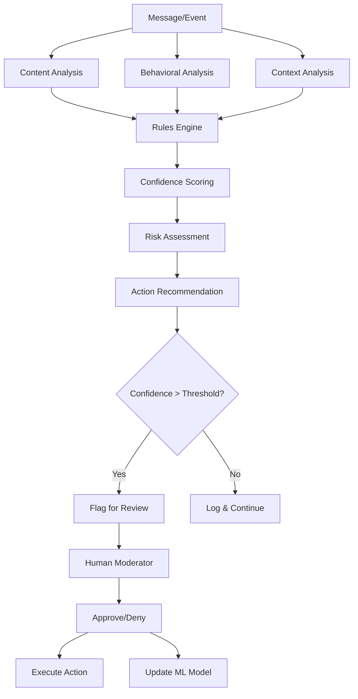

# 🛡️ Moderation Model & Philosophy

## Core Philosophy: Human-in-the-Loop

Supremo's moderation system is built on the principle that **technology should assist, not replace, human moderators**. Our approach ensures that:

- ✅ **Never Auto-Punish**: All destructive actions require human approval
- ✅ **Full Transparency**: Every decision is logged and explainable  
- ✅ **Configurable**: Adapt to your community's unique needs
- ✅ **Learning System**: Improves based on moderator feedback

## 🧠 Intelligence Framework

### 1. Multi-Layer Analysis



### 2. Content Analysis Engine

**Text Analysis:**
- Spam detection (repetitive content, excessive caps)
- Toxicity detection (harassment, hate speech)
- NSFW content identification
- Scam/phishing detection
- Custom keyword filtering

**Pattern Recognition:**
- Message frequency analysis
- Cross-channel behavior tracking
- Coordinated activity detection
- Suspicious link patterns

**Context Awareness:**
- Channel-specific rules
- User role considerations
- Time-based patterns
- Community guidelines alignment

### 3. Behavioral Intelligence

**Trust Scoring System:**
```typescript
interface TrustFactors {
  accountAge: number;        // Days since account creation
  serverTenure: number;      // Days in current server
  messageQuality: number;    // Quality score (0-1)
  ruleCompliance: number;    // Historical compliance (0-1)
  socialConnections: number; // Positive interactions
  verificationLevel: number; // Account verification status
}

// Trust Score Calculation
trustScore = (
  accountAge * 0.2 +
  serverTenure * 0.15 +
  messageQuality * 0.2 +
  ruleCompliance * 0.25 +
  socialConnections * 0.15 +
  verificationLevel * 0.05
) / 6
```

**Risk Assessment:**
- New account monitoring
- Rapid role changes detection
- Unusual activity patterns
- Cross-server reputation (optional)

## 🎯 Moderation Workflow

### 1. Detection Phase

**Automatic Scanning:**
- Real-time message analysis
- Behavioral pattern monitoring
- Cross-reference with known patterns
- Community-specific rule evaluation

**Signal Processing:**
```typescript
interface ModerationSignal {
  type: 'message' | 'join' | 'role_change' | 'voice_activity';
  confidence: number;        // 0-1 confidence score
  severity: 'low' | 'medium' | 'high' | 'critical';
  triggers: string[];        // Which rules triggered
  context: SignalContext;    // Additional context
  suggestedAction: Action;   // Recommended response
}
```

### 2. Review Phase

**Incident Creation:**
- Automatic incident generation for high-confidence detections
- Evidence collection and attachment
- Context preservation
- Timeline reconstruction

**Moderator Dashboard:**
- Priority queue based on severity and confidence
- Rich context display
- One-click action buttons
- Bulk operation support

**Decision Support:**
- Historical similar cases
- Community guideline references
- Escalation recommendations
- Impact assessment

### 3. Action Phase

**Available Actions:**
- **Warn**: Send warning message to user
- **Mute**: Temporary or permanent mute
- **Kick**: Remove from server
- **Ban**: Permanent removal with optional cleanup
- **Timeout**: Discord native timeout feature
- **Role Management**: Add/remove roles
- **Message Actions**: Delete, edit, or flag messages

**Execution Safeguards:**
- Confirmation prompts for destructive actions
- Audit trail creation
- Notification to affected users
- Appeal process initiation

### 4. Learning Phase

**Feedback Loop:**
- Moderator approval/rejection tracking
- False positive/negative analysis
- Rule effectiveness measurement
- Model parameter adjustment

**Continuous Improvement:**
- Weekly accuracy reports
- Monthly model retraining
- Community-specific optimization
- Performance metrics tracking

## 🔧 Configuration System

### 1. Rule Configuration

**Content Rules:**
```yaml
spam_detection:
  enabled: true
  sensitivity: 0.8          # 0-1 scale
  auto_delete: false        # Require approval
  exempt_roles: 
    - "moderator"
    - "trusted_member"
  exempt_channels:
    - "staff-chat"
    - "bot-commands"

toxicity_detection:
  enabled: true
  threshold: 0.7
  escalation_rules:
    - violations: 3
      timeframe: "24h"
      action: "timeout"
      duration: "1h"
```

**Behavioral Rules:**
```yaml
trust_system:
  enabled: true
  new_account_threshold: 7  # days
  low_trust_restrictions:
    - no_image_uploads
    - rate_limited_messages
    - restricted_channels
  
anti_raid:
  join_rate_limit: 10       # users per minute
  account_age_gate: 7       # days minimum
  auto_lockdown: true
  lockdown_duration: "30m"
```

### 2. Automation Workflows

**Conditional Actions:**
```typescript
interface AutomationRule {
  name: string;
  triggers: Trigger[];
  conditions: Condition[];
  actions: Action[];
  enabled: boolean;
  priority: number;
}

// Example: Auto-role assignment for verified users
const verifiedUserRule: AutomationRule = {
  name: "Verified User Auto-Role",
  triggers: [{ type: "user_verified" }],
  conditions: [
    { field: "account_age", operator: ">=", value: 30 },
    { field: "trust_score", operator: ">=", value: 0.7 }
  ],
  actions: [
    { type: "add_role", roleId: "verified_member" },
    { type: "send_dm", template: "welcome_verified" }
  ],
  enabled: true,
  priority: 5
};
```

## 📊 Analytics & Reporting

### 1. Moderation Metrics

**Effectiveness Tracking:**
- Detection accuracy rates
- False positive/negative rates
- Response time metrics
- Resolution success rates

**Workload Analysis:**
- Incidents per moderator
- Peak activity periods
- Case complexity distribution
- Burnout risk indicators

### 2. Community Health

**Trend Analysis:**
- Violation frequency over time
- User behavior improvements
- Community growth correlation
- Seasonal pattern recognition

**Predictive Insights:**
- Risk user identification
- Potential raid detection
- Community tension indicators
- Intervention recommendations

## 🛠️ Advanced Features

### 1. Custom Rule Engine

**Visual Rule Builder:**
- Drag-and-drop interface
- Logic flow visualization
- Real-time testing
- Template marketplace

**Scripting Support:**
```javascript
// Custom rule example
function customSpamDetection(message) {
  const words = message.content.split(' ');
  const uniqueWords = new Set(words);
  
  // High repetition ratio indicates spam
  const repetitionRatio = 1 - (uniqueWords.size / words.length);
  
  return {
    triggered: repetitionRatio > 0.7,
    confidence: repetitionRatio,
    reason: `High word repetition: ${(repetitionRatio * 100).toFixed(1)}%`
  };
}
```

### 2. Machine Learning Integration

**Model Training:**
- Community-specific datasets
- Federated learning approach
- Privacy-preserving techniques
- Continuous model updates

**Feature Engineering:**
- Semantic text analysis
- Behavioral pattern extraction
- Network analysis features
- Temporal pattern recognition

### 3. Integration Ecosystem

**External Services:**
- Perspective API for toxicity detection
- Custom ML model endpoints
- Third-party reputation services
- Cross-platform data sharing

**Webhook System:**
- Real-time event notifications
- Custom action triggers
- External system integration
- Audit trail forwarding

## 🔒 Privacy & Compliance

### 1. Data Protection

**Data Minimization:**
- Only collect necessary data
- Automatic data retention policies
- User data deletion on request
- Anonymization for analytics

**Encryption:**
- End-to-end encryption for sensitive data
- Secure key management
- Regular security audits
- Compliance certifications

### 2. Transparency

**User Rights:**
- View personal data collected
- Download moderation history
- Request data correction
- Appeal moderation decisions

**Audit Trail:**
- Complete action history
- Decision reasoning logs
- Model version tracking
- Performance metrics

## 🎯 Best Practices

### 1. Implementation Guidelines

**Gradual Rollout:**
1. Start with observation mode
2. Enable low-risk actions first
3. Gradually increase automation
4. Maintain human oversight

**Community Alignment:**
1. Involve community in rule creation
2. Regular feedback collection
3. Transparent policy updates
4. Clear appeal processes

### 2. Moderator Training

**System Understanding:**
- How AI decisions are made
- When to trust vs. override
- Bias recognition and mitigation
- Continuous learning importance

**Workflow Optimization:**
- Efficient review processes
- Batch operation techniques
- Priority management
- Escalation procedures

This moderation model ensures that Supremo provides powerful automation while maintaining the human judgment and community values that make Discord communities thrive.